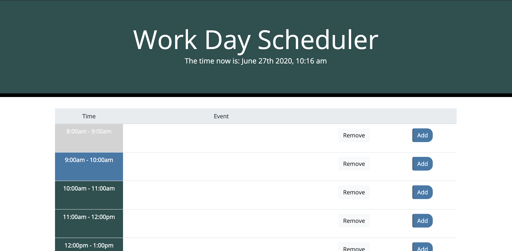

# Overview of Functionality 
This is a daily planner/scheduler. 

Users can add in event, tasks, meetings, etc by clicking within the "Event" column corresponding to the time of their event and clicking the "add" button. 

All added events will be stored to the local storage, so the user can leave the application and their schedule will be saved. 

If they wish to remove an event, for example, if it is cancelled, they simply click "remove". This will remove the event from the Event column and remove it from the local storage, so it will never appear again. 

The time blocks in the lefthand "Time" column will change colors depending on whether the event is upcoming for that day, is taking place at the moment, or has already occurred. 

# Images: 
Website home screen, with nothing yet added: 

Website with events added: 